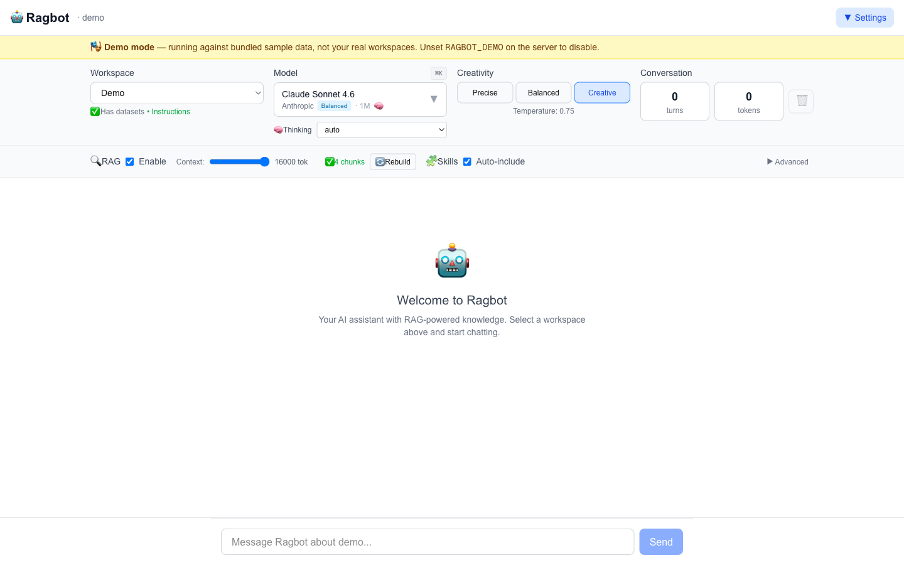
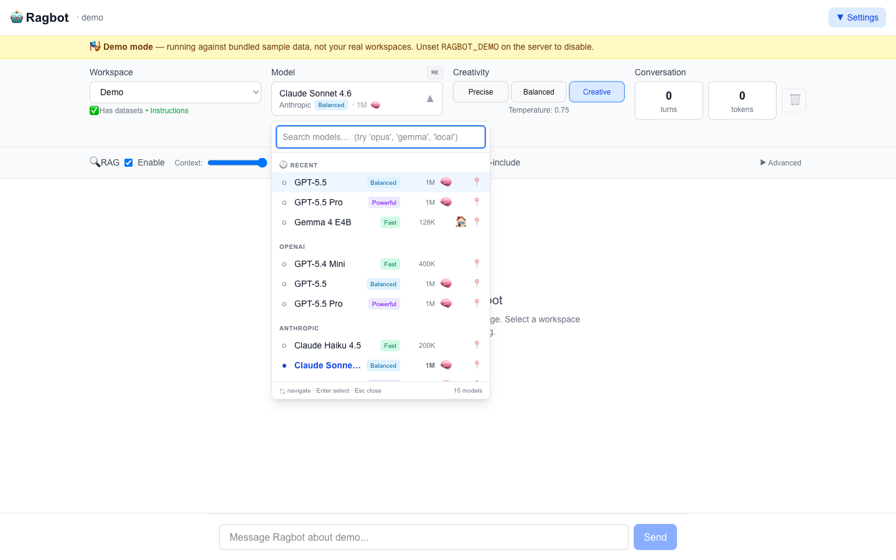
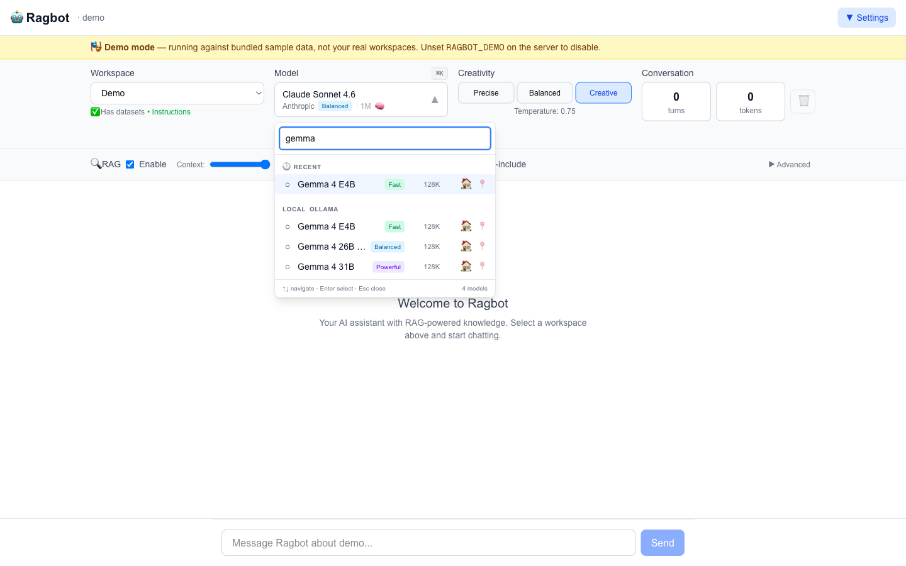
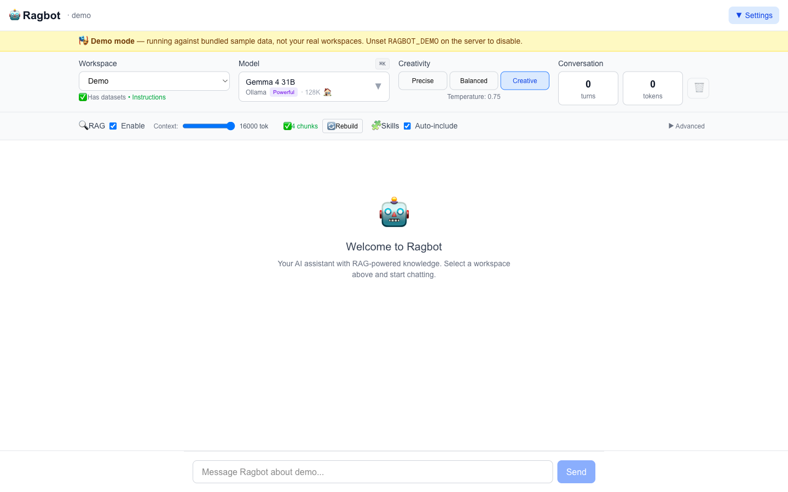
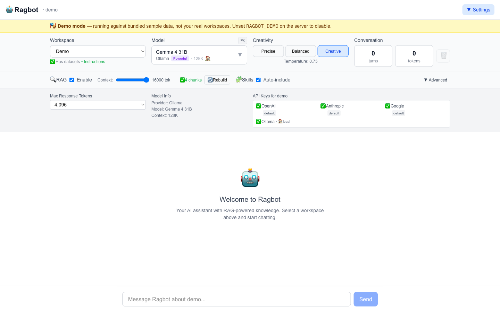
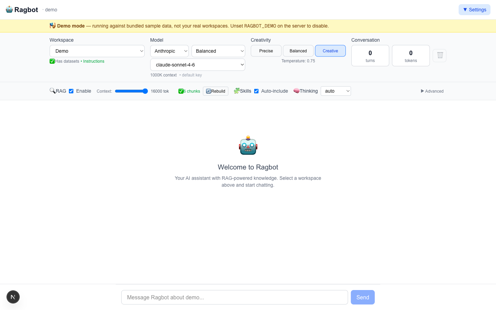
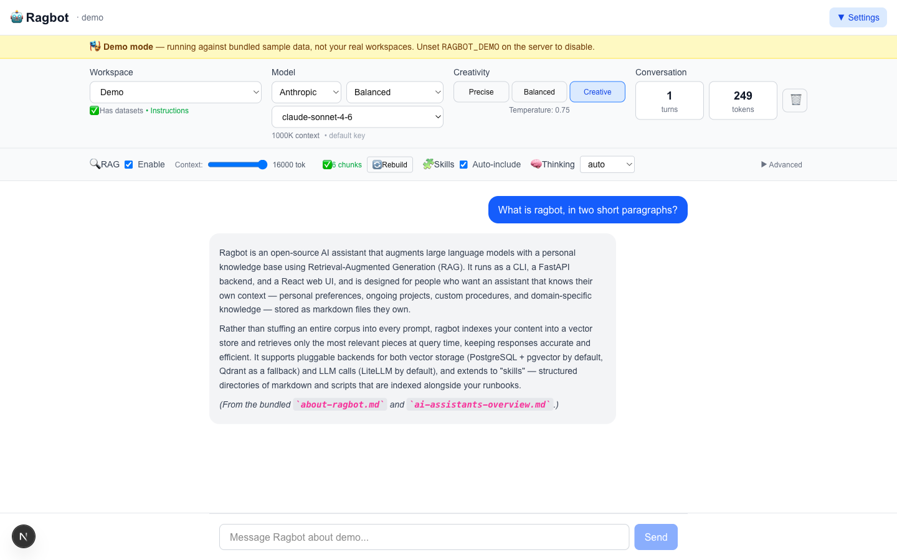
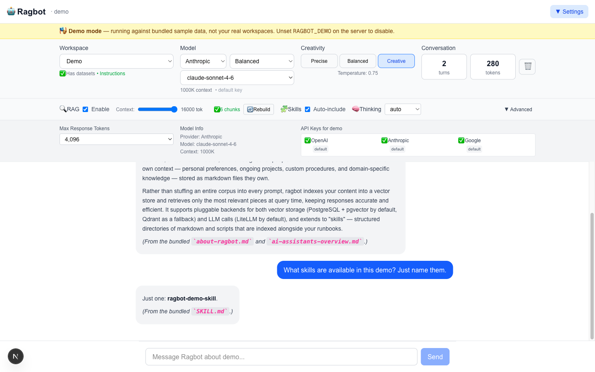

# Ragbot — the open-source reference runtime for conversational synthesis engineering.

Ragbot is the chat-led runtime of [synthesis engineering](https://synthesisengineering.org) — the open methodology for systematic human-AI collaboration on complex work. It is the workbench where humans and AI do the crafts of synthesis one collaborative turn at a time, on the user's own workspace, with skills, agent execution, durable memory, and bi-directional MCP. Workspace-aware. Local-first with frontier fallback. Production-grade observability. MIT-licensed.

Developed by [Rajiv Pant](https://github.com/rajivpant). See [INSTALL.md](INSTALL.md) for setup, [CONFIGURE.md](CONFIGURE.md) for keys and providers, and [CONTRIBUTING.md](CONTRIBUTING.md) before opening a PR.

## v3.4 — coming soon

The v3.4 series advances Ragbot along the architectural directions the synthesis-engineering methodology calls for:

- **Agent loop.** Multi-step planning, tool use, and self-correction inside a single turn, with the human in the loop at meaningful decision points rather than every tool call.
- **Bi-directional MCP.** Ragbot as both an MCP client (consuming tools from external servers) and an MCP server (exposing its own workspace, skills, and retrieval surfaces to other agents and IDEs).
- **Skills runtime.** First-class execution of `synthesis-skills` capabilities — discovery, parameterised invocation, and reproducible runs — promoting skills from "indexed documents" to "callable functions."
- **Cross-workspace synthesis.** Retrieval and reasoning that span multiple `ai-knowledge-*` workspaces with explicit provenance, beyond the current single-workspace-plus-skills auto-include.
- **Memory beyond RAG.** Durable, structured memory that complements vector retrieval — episodic conversation history, learned preferences, and long-running project state under the user's control.

## What's New in v3.3

Ragbot v3.3 (May 2026) adds first-class local model support and a
redesigned model picker:

- **Local Gemma 4 via Ollama.** A new `ollama` engine ships Google's Gemma 4
  family (E4B, 26B MoE, 31B Dense) as first-class models alongside Anthropic,
  OpenAI, and Google. No API key required; LiteLLM routes via the
  `ollama_chat/` prefix. The Docker stack reaches host Ollama via
  `host.docker.internal:11434` out of the box (configurable with
  `OLLAMA_API_BASE` if Ollama runs elsewhere on your LAN).
- **Redesigned model picker.** A single rich dropdown replaces the
  three-step Provider → Category → Model cascade. Display names
  (`Claude Opus 4.7` instead of `claude-opus-4-7`). Pinned and Recent
  sections at the top. Type-ahead search. `⌘K` / `Ctrl+K` global shortcut.
  Per-row badges for tier (Fast / Balanced / Powerful), context window,
  🧠 thinking, 🏠 local.
- **User preferences API.** New `/api/preferences/pinned-models` and
  `/api/preferences/recent-models` endpoints persist your model selections
  across sessions in `~/.synthesis/ragbot.yaml`.
- **Thinking control moved adjacent to Model.** Renders inline below the
  picker, only for thinking-capable models — so the control isn't there
  when it has no effect.
- **Bug fix:** non-flagship GPT-5.x and Gemini models no longer return
  empty content on long-context RAG calls. The default `reasoning_effort`
  for these models is now the lowest declared mode (`minimal`) rather than
  unset, so the provider's own reasoning default doesn't consume the entire
  output-token budget.
- **Security.** LiteLLM pinned `>=1.83.0` in requirements (excludes the
  compromised 1.82.7 / 1.82.8 range from the March 2026 supply-chain
  incident).



The model picker, opened — one dropdown grouped by provider with Pinned,
Recent, type-ahead search, and capability badges:



Type-ahead filters across the full list. Searching `gemma` surfaces all
three local Gemma 4 variants:



Selecting a local model surfaces the 🏠 badge on the trigger and hides the
Thinking control (Gemma 4 doesn't expose thinking effort):



Advanced panel — per-provider API-key status, including the new
local-only Ollama entry:



## What's New in v3.2

Ragbot v3.2 (April 2026) ships a one-command demo mode and a refreshed
screenshot set captured against it:

- **Demo mode** via `RAGBOT_DEMO=1` (or `ragbot --demo`) ships a small
  bundled workspace and skill in `demo/`, hard-isolates discovery from
  the user's real workspaces, and surfaces an unmistakable banner in
  the Web UI. Anyone can clone the repo, set an API key, and have a
  working chat with RAG retrieval in under a minute — no database or
  workspace setup needed.
- **`/health` and `/api/config`** report `demo_mode` so any consumer
  (UI, ops dashboards, screenshot tools) can render the right
  affordances.
- **Twenty new tests** lock in the discovery isolation contract so a
  future change can't accidentally let real workspace or skill names
  leak through when demo mode is on.



A live conversation in demo mode showing RAG retrieval citing the
bundled sample documents:



## What's New in v3.1

Ragbot v3.1 (April 2026) adds an LLM backend abstraction that decouples ragbot from any single provider gateway:

- **Swappable LLM backends** via `RAGBOT_LLM_BACKEND={litellm|direct}`. The default `litellm` backend keeps the broadest provider/model coverage; the `direct` backend calls Anthropic, OpenAI, and google-genai SDKs directly with no third-party dependency. Adding alternatives (Bifrost, Portkey, OpenRouter) is a one-file change.
- **Web UI controls** for reasoning effort and the cross-workspace skills toggle, alongside the existing workspace/model picker.
- **`/api/chat`** accepts `thinking_effort` and `additional_workspaces` fields directly.

Strategic note on LiteLLM in 2026: it remains a defensible default because of provider/model coverage, but the March-2026 supply-chain incident (versions 1.82.7–1.82.8) and the API-compatibility lag for Claude 4.7+'s `thinking.type.adaptive` shape are real frictions. Pinning `>=1.83.0` avoids the compromised range; the abstraction layer makes a future swap a configuration change, not a code rewrite.

## What's New in v3.0

Ragbot v3.0 (April 2026) ships three major upgrades over v2:

- **Pgvector by default.** PostgreSQL with the `pgvector` extension is the default vector backend, replacing embedded Qdrant. Native full-text search via `tsvector` + GIN replaces in-process BM25. The legacy embedded Qdrant backend remains as an opt-in fallback (`RAGBOT_VECTOR_BACKEND=qdrant`).
- **Agent Skills as first-class content.** Ragbot discovers and indexes Agent Skills (`SKILL.md` plus references and scripts) from `~/.synthesis/skills`, `~/.claude/skills`, and plugin caches. New `ragbot skills {list,info,index}` CLI. The compiler can include skills via a `sources.skills` block in `compile-config.yaml`.
- **Workspace-rooted layout.** AI Knowledge repos are discovered across `~/workspaces/*/ai-knowledge-*` and via the synthesis-engineering shared `~/.synthesis/console.yaml` source list. Configuration moved to `~/.synthesis/` (legacy `~/.config/ragbot/` falls through).

Plus reasoning-effort wiring (Claude 4.x adaptive thinking, GPT-5.5 reasoning, Gemini 3.x thinking levels) — see `--thinking-effort` and `RAGBOT_THINKING_EFFORT`.

## Synthesis Engineering Ecosystem

Ragbot is a reference implementation of the synthesis-engineering methodology, focused on the **conversational** interaction primitive. Sibling reference implementations cover other primitives: **synthesis-console** for direct manipulation (browse and edit), **Ragenie** for the procedural primitive (workflow definition with autonomous execution), and **synthesis-skills** as the portable capability format consumed by every runtime and by external SKILL.md-compatible agents (Claude Code, Codex CLI, Cursor, Gemini CLI). The family of reference implementations will grow as the methodology and the AI landscape evolve. All implementations share the `~/.synthesis/` config home, the `ai-knowledge-*` workspace model, and a Python substrate library, and they integrate through Model Context Protocol (MCP) calls and a filesystem-as-source-of-truth contract.

## Development Methodology

Ragbot is developed using **Synthesis Engineering** (also known as **Synthesis Coding**)—a systematic approach that combines human architectural expertise with AI-assisted implementation. This methodology ensures that while AI accelerates development velocity, engineers maintain architectural authority, enforce quality standards, and deeply understand every component of the system.

Key principles applied in Ragbot's development:
- Human-defined architecture with AI-accelerated implementation
- Systematic quality assurance regardless of code origin
- Context preservation across development sessions
- Iterative refinement based on real-world usage

Learn more about this approach:
- [Synthesis Engineering: The Professional Practice](https://rajiv.com/blog/2025/11/09/synthesis-engineering-the-professional-practice-emerging-in-ai-assisted-development/)
- [The Organizational Framework](https://rajiv.com/blog/2025/11/09/the-synthesis-engineering-framework-how-organizations-build-production-software-with-ai/)
- [Technical Implementation with Claude Code](https://rajiv.com/blog/2025/11/09/synthesis-engineering-with-claude-code-technical-implementation-and-workflows/)

Code Contributors & Collaborators
- [Alexandria Redmon](https://github.com/alexdredmon)
- [Ishaan Jaffer](https://www.linkedin.com/in/reffajnaahsi/)
- [Trace Wax](https://github.com/tracedwax)
- [Jim Mortko](https://github.com/jskills)
- [Vik Pant](https://www.linkedin.com/in/vikpant/)

How to Contribute

Your code contributions are welcome! Please read [CONTRIBUTING.md](CONTRIBUTING.md) for important safety guidelines (especially about not committing personal data), then fork the repository and submit a pull request with your improvements.

[](https://sourcegraph.com/github.com/synthesisengineering/ragbot)

Quick Start
-----------

Get Ragbot running in 5 minutes:

### Option 1: Quick Start with Example Data (Fastest)

```bash
# 1. Clone this repository
git clone https://github.com/synthesisengineering/ragbot.git
cd ragbot

# 2. Set up your API keys
cp .env.docker .env
# Edit .env and add at least one API key (OpenAI, Anthropic, or Gemini)

# 3. Get starter templates from ai-knowledge-ragbot
git clone https://github.com/rajivpant/ai-knowledge-ragbot.git ~/ai-knowledge-ragbot
cp -r ~/ai-knowledge-ragbot/source/datasets/templates/ datasets/my-data/
cp ~/ai-knowledge-ragbot/source/instructions/templates/default.md instructions/

# 4. Customize with your information
# Edit the files in datasets/my-data/ with your personal details

# 5. Start Ragbot with Docker
docker-compose up -d

# 6. Access the web interface
open http://localhost:3000
```

### Option 2: Using Your Own Data Repository (Recommended for Production)

If you want to keep your data in a separate directory or private repository:

```bash
# 1. Clone Ragbot
git clone https://github.com/synthesisengineering/ragbot.git
cd ragbot

# 2. Create your data directory
mkdir ~/ragbot-data
# Or clone your private data repo: git clone <your-private-repo> ~/ragbot-data

# 3. Set up Docker override
cp docker-compose.override.example.yml docker-compose.override.yml
# Edit docker-compose.override.yml to point to your data directory

# 4. Organize your data (get templates from ai-knowledge-ragbot)
git clone https://github.com/rajivpant/ai-knowledge-ragbot.git ~/ai-knowledge-ragbot
cp -r ~/ai-knowledge-ragbot/source/datasets/templates/* ~/ragbot-data/datasets/
cp ~/ai-knowledge-ragbot/source/instructions/templates/default.md ~/ragbot-data/instructions/

# 5. Configure API keys
cp .env.docker .env
# Edit .env with your API keys

# 6. Start Ragbot
docker-compose up -d
```

### What's Next?

- 📖 **Knowledge Base:** Get templates and runbooks from [ai-knowledge-ragbot](https://github.com/rajivpant/ai-knowledge-ragbot)
- 🎓 **Understand the philosophy:** Read [docs/DATA_ORGANIZATION.md](docs/DATA_ORGANIZATION.md)
- 🐳 **Docker deployment:** See [README-DOCKER.md](README-DOCKER.md) for deployment guide
- 🤝 **Contributing safely:** Read [CONTRIBUTING.md](CONTRIBUTING.md) before contributing
- ⚙️ **Detailed setup:** Follow the [installation guide](INSTALL.md) and [configuration guide](CONFIGURE.md)

Try the Demo (v3.2+)
--------------------

Want to evaluate ragbot end-to-end without setting up a workspace, a
database, or any data? Use demo mode:

```bash
git clone https://github.com/synthesisengineering/ragbot.git
cd ragbot
cp .env.example .env
# Edit .env to set at least one API key (Anthropic, OpenAI, or Google).

# Install Python deps (in your preferred virtualenv):
pip install -r requirements.txt

# Start the bundled Postgres + ragbot stack:
docker compose up -d

# Run any subcommand in demo mode:
RAGBOT_DEMO=1 python3 src/ragbot.py db status
RAGBOT_DEMO=1 python3 src/ragbot.py skills list
RAGBOT_DEMO=1 python3 src/ragbot.py chat -p "What is ragbot?"
```

Or for the Web UI:

```bash
RAGBOT_DEMO=1 python3 -m uvicorn src.api.main:app --port 8000 &
cd web && npm install && NEXT_PUBLIC_API_URL=http://localhost:8000 npm run dev
# Open http://localhost:3000 — you'll see a yellow "🎭 Demo mode" banner.
```

Demo mode hard-isolates discovery to the bundled `demo/ai-knowledge-demo/`
workspace and `demo/skills/ragbot-demo-skill/`. Real workspaces on the
host are invisible to discovery while `RAGBOT_DEMO=1` is set, so the
demo is safe to drive in front of an audience or to capture
screenshots from. Unset the env var to return to your real workspaces.

Configuration Layout (v3+)
-------------------------

Ragbot's user configuration lives under `~/.synthesis/` (a shared home for synthesis-engineering tools — keys are reused by other tools in the family without duplication):

```
~/.synthesis/
├── keys.yaml         # API keys (per-provider; per-workspace overrides supported)
├── ragbot.yaml       # Ragbot user prefs (default_workspace, etc.)
└── console.yaml      # Synthesis-console source list (optional; ragbot reads it for repo discovery)
```

Legacy `~/.config/ragbot/{keys,config}.yaml` is still read as a fallback so existing setups keep working.

Vector Backend
--------------

Ragbot's default vector store is PostgreSQL with the `pgvector` extension. The schema is shared across workspaces (one `chunks` table with a `workspace` column, an HNSW vector index for cosine ANN, and a generated `tsvector` + GIN index for native full-text search). Migrations are applied idempotently on first connection.

For local development without Docker, install pgvector for your PostgreSQL and point `RAGBOT_DATABASE_URL` at it. With Docker Compose, the bundled `postgres` service starts automatically. See [CONFIGURE.md](CONFIGURE.md) for both paths.

Use `ragbot db status` to confirm the active backend, and the legacy embedded Qdrant backend remains available via `RAGBOT_VECTOR_BACKEND=qdrant`.

Agent Skills
------------

Ragbot indexes Agent Skills (directories containing `SKILL.md`) as first-class content. The full directory tree is honoured — `references/**/*.md` and bundled scripts (`*.py`, `*.sh`, etc.) are all indexed and become queryable via RAG.

```bash
ragbot skills list                   # show all discovered skills
ragbot skills info <skill-name>      # full details for one skill
ragbot skills index                  # index all skills into the 'skills' workspace
```

Discovery sources (later wins on name collision):

1. `~/.synthesis/skills/` (synthesis-engineering shared install)
2. `~/.claude/skills/` (Claude Code private)
3. `~/.claude/plugins/cache/<vendor>/skills/` (plugin-installed)
4. Per-workspace roots declared in `compile-config.yaml` (`sources.skills.roots`)

When the `skills` workspace has indexed content, `ragbot chat` automatically merges its results with the user's selected workspace via cross-workspace retrieval. Disable per-call with `--no-skills` or programmatically via `additional_workspaces=[]`.

Reasoning / Thinking Modes
--------------------------

Models that advertise thinking support in `engines.yaml` (Claude Sonnet 4.6, Claude Opus 4.7, GPT-5.5, GPT-5.5-pro, Gemini 3.x) are wired through LiteLLM's `reasoning_effort` parameter. Defaults: flagship models → `medium`, non-flagship with thinking → `off`, models without thinking metadata → silent (no params sent).

```bash
ragbot chat --thinking-effort high -p "explain this..."          # explicit high effort
RAGBOT_THINKING_EFFORT=low ragbot chat -p "explain this..."      # globally low
ragbot chat --thinking-effort off -p "..."                       # disable on a flagship
```

RAG (Retrieval-Augmented Generation)
------------------------------------

Ragbot implements a **production-grade, multi-stage RAG pipeline** based on research from leading AI systems including Perplexity, ChatGPT, Claude, and Gemini. Unlike simple RAG implementations, Ragbot uses sophisticated techniques proven to significantly improve retrieval accuracy.

### Architecture Overview

```
Query → Phase 1 → Phase 2 → Phase 3 → Generate → Phase 4 → Response
        Foundation  Query     Hybrid    Response   Verify    with
                   Intel    Retrieval             & CRAG   Confidence
```

**Four-Phase Pipeline:**

| Phase | Description | Key Techniques |
|-------|-------------|----------------|
| **Phase 1** | Foundation | Query preprocessing, full document retrieval, 16K context budget |
| **Phase 2** | Query Intelligence | LLM planner, multi-query expansion (5-7 variations), HyDE |
| **Phase 3** | Hybrid Retrieval | BM25 + Vector search, Reciprocal Rank Fusion, LLM reranking |
| **Phase 4** | Verification | Hallucination detection, confidence scoring, CRAG loop |

### Research-Backed Impact

Based on benchmarks from Anthropic, Microsoft, and other research:

| Technique | Impact |
|-----------|--------|
| Contextual embeddings | **35% fewer retrieval failures** |
| Hybrid search + reranking | **67% fewer retrieval failures** |
| Query rewriting (multi-query) | **+21 NDCG points** |

### Phase 1: Foundation Layer

- **Query Preprocessing**: Expands contractions ("what's" → "what is"), extracts key terms
- **Document Detection**: Recognizes "show me my biography" style queries
- **Full Document Retrieval**: Returns complete documents instead of fragments when appropriate
- **Enhanced Embeddings**: Includes filename and title in embeddings for better matching

### Phase 2: Query Intelligence

- **LLM Query Planner**: Analyzes intent, determines retrieval strategy
- **Multi-Query Expansion**: Generates 5-7 query variations for better recall
- **HyDE (Hypothetical Document Embeddings)**: Generates hypothetical answers for semantic search
- **Provider-Agnostic**: Uses fast model from same provider as user's selection

### Phase 3: Hybrid Retrieval

- **Dual Search**: Combines semantic (vector) and lexical (BM25) search
- **Reciprocal Rank Fusion**: Merges results from both search methods
- **LLM Reranking**: Scores relevance 0-10, reorders by combined score
- **Result**: Best of both semantic understanding and exact keyword matching

### Phase 4: Response Verification

- **Claim Extraction**: Identifies factual claims in generated responses
- **Evidence Matching**: Checks each claim against retrieved context
- **Confidence Scoring**: 0.0-1.0 score based on claim verification
- **CRAG (Corrective RAG)**: Re-retrieves for low-confidence responses (<0.7)

### Using RAG in the Web UI

1. Select a workspace in the sidebar
2. Click **"Index Workspace"** in Advanced Settings to build the index (first time only)
3. Enable **"Enable RAG"** checkbox
4. Adjust **"RAG context tokens"** slider to control how much context is retrieved

### Configuration

| Setting | Default | Description |
|---------|---------|-------------|
| Enable RAG | On | Toggle RAG-augmented responses |
| RAG context tokens | 16000 | Maximum tokens for retrieved context |
| Confidence threshold | 0.7 | CRAG triggers below this score |
| Embedding model | all-MiniLM-L6-v2 | 384-dimension embeddings |

### Technical Details

- **Vector Database**: Qdrant (local file-based storage at `/app/qdrant_data`)
- **Embedding Model**: sentence-transformers `all-MiniLM-L6-v2` (80MB, 384 dimensions)
- **Chunking**: ~500 tokens per chunk with 50-token overlap
- **Similarity**: Cosine distance for semantic matching

For the complete technical architecture, see [docs/rag-architecture.md](docs/rag-architecture.md).

AI Knowledge Integration
------------------------

Ragbot integrates with the **AI Knowledge** ecosystem for managing knowledge bases across multiple workspaces.

### Open Source Knowledge Base

The **[ai-knowledge-ragbot](https://github.com/rajivpant/ai-knowledge-ragbot)** repository contains open-source runbooks, templates, and guides that ship with Ragbot:

- **Instruction templates** - Starter configurations for AI assistants
- **Dataset templates** - Personal and professional profile templates
- **Runbooks** - Procedures for content creation, communication, system configuration
- **Guides** - Reference materials for working with AI

Personal ai-knowledge repos can inherit from ai-knowledge-ragbot to get these shared resources while adding private content.

### AI Knowledge System

The AI Knowledge system manages content across multiple workspaces using a three-part architecture:

| Operation | Where | When |
|-----------|-------|------|
| Knowledge concatenation (`all-knowledge.md`) | CI/CD (GitHub Actions) | Every push to `source/` |
| Instruction compilation | Local (`ragbot compile`) | When instructions change (rare) |
| RAG indexing | Local (`ragbot index`) | When content changes + RAG needed |

**Key concept:** Edit `source/` files directly. Knowledge concatenation is automatic. See [docs/compilation-guide.md](docs/compilation-guide.md) for details.

```
ai-knowledge-{workspace}/
├── source/                    # Your source files (authoritative)
│   ├── instructions/          # WHO - Identity, persona, rules
│   ├── runbooks/             # HOW - Procedures, workflows
│   └── datasets/             # WHAT - Reference knowledge
├── compiled/                  # Auto-generated
│   └── {project}/
│       └── instructions/      # LLM-specific (claude.md, chatgpt.md, gemini.md)
└── all-knowledge.md           # Concatenated knowledge (CI/CD via GitHub Actions)
```

Quick examples:

```bash
# Compile instructions for a project
ragbot compile --project {name} --no-llm

# Index workspace for RAG
ragbot index --workspace {name}
```

For detailed setup instructions, see the [LLM Project Setup Guide](https://github.com/rajivpant/ai-knowledge-ragbot/blob/main/source/runbooks/system-config/llm-project-setup.md).

### Convention-Based Discovery

Ragbot automatically discovers AI Knowledge repositories by convention:

1. Mount your `ai-knowledge` parent directory to `/app/ai-knowledge`
2. Ragbot scans for directories matching `ai-knowledge-{workspace}`
3. Each discovered repo provides instructions and knowledge for that workspace

### Docker Setup with AI Knowledge

```yaml
# docker-compose.override.yml
services:
  ragbot-web:
    volumes:
      - ${HOME}/workspaces:/root/workspaces:ro
      - ./workspaces:/app/workspaces:ro
```

### Workspace Configuration

Create `workspace.yaml` files to customize workspace behavior:

```yaml
# workspaces/my-project/workspace.yaml
name: My Project
description: Project-specific AI assistant
status: active
type: work
inherits_from:
  - personal  # Inherit from personal workspace
```

### Content Loading Strategy

| Content Type | Loading Method | Use Case |
|--------------|----------------|----------|
| Instructions | Always loaded | Core identity and behavior |
| Datasets | Direct or RAG | Small: direct, Large: RAG |
| Runbooks | RAG retrieval | Retrieved when relevant |

Supported AI Models
-------------------

Ragbot supports models from Anthropic (Claude), OpenAI (GPT and reasoning models), Google (Gemini), and local models via Ollama (Gemma 4 family ships out of the box). The authoritative list — model IDs, context windows, thinking-mode support, tier badges, and defaults — lives in [engines.yaml](engines.yaml). v3.3's redesigned model picker reads from the same file at runtime, so what you see in the UI matches what is configured in the repo.

Adding or updating models is an `engines.yaml` change, not a code change. See the [v3.3 release notes](#whats-new-in-v33) for the local-model integration details.

Installation, Configuration, and Personalization
------------------------------------------------
Read the [installation guide](INSTALL.md) and the [configuration and personaliation guide](CONFIGURE.md).

Using the Web version
---------------------
_The screenshots below were captured against the bundled demo workspace.
The model-picker and advanced-panel shots reflect v3.3 (May 2026); the
chat-and-skills shots are still v3.2 captures since those features didn't
change. The full sets are at [`screenshots/v3.3/`](screenshots/v3.3/) and
[`screenshots/v3.2/`](screenshots/v3.2/)._

**Settings panel and welcome state (v3.3)**


**Model picker open — Pinned, Recent, and by-provider sections (v3.3)**


**A chat that retrieves from the bundled sample documents (v3.2)**


**Advanced settings expanded (v3.3)**


**Cross-workspace skills auto-include (v3.2)**

A follow-up question retrieves from the bundled demo skill via the cross-workspace fan-out:



<!--
Legacy screenshots from earlier ragbot versions, kept on disk for archival
reference but no longer rendered in the README. The v3.2 captures above
reflect the current Web UI.
  - screenshots/Screenshot 2023-06-16 at 10.53.12 PM.png
  - screenshots/Screenshot 2024-04-10 at 10.46.02 PM.png
  - screenshots/Screenshot 2023-08-02 at 10.30.37 PM.png
-->


Using the command line interface
--------------------------------

The CLI uses workspaces with RAG (Retrieval-Augmented Generation) and automatically loads LLM-specific instructions based on the model you're using.

### Key CLI Options

```
ragbot chat [options]

Input Options:
  -p, --prompt PROMPT          Prompt text
  -f, --prompt_file FILE       Read prompt from file
  -i, --interactive            Interactive mode with history
  --stdin                      Read prompt from stdin

Workspace & Knowledge:
  -profile NAME                Workspace to use (auto-loads instructions and enables RAG)
  --rag / --no-rag            Enable/disable RAG retrieval (default: enabled)

Model Selection:
  -e {openai,anthropic,google} Engine/provider
  -m MODEL                     Model name (or 'flagship' for best)

Custom Instructions:
  -c PATH [PATH ...]           Explicit instruction files (overrides auto-loading)
  -nc                          Disable all instructions
```

### Using Workspaces with RAG

The recommended way to use the CLI is with workspaces:

```bash
# Chat with a workspace - instructions auto-loaded, RAG enabled
ragbot chat -profile personal -p "What are my travel preferences?"

# Use Anthropic Claude (loads claude.md instructions)
ragbot chat -profile personal -e anthropic -p "Summarize my work history"

# Use OpenAI GPT-5.2 (loads chatgpt.md instructions)
ragbot chat -profile personal -e openai -m gpt-5.2 -p "Summarize my work history"

# Use Google Gemini (loads gemini.md instructions)
ragbot chat -profile personal -e google -p "Summarize my work history"
```

### LLM-Specific Instructions

The system automatically loads the correct instruction file based on the LLM:

| Engine | Instruction File |
|--------|------------------|
| anthropic | `compiled/{workspace}/instructions/claude.md` |
| openai | `compiled/{workspace}/instructions/chatgpt.md` |
| google | `compiled/{workspace}/instructions/gemini.md` |

### Interactive Mode

Maintain conversation history across multiple prompts:

```bash
ragbot chat -profile personal -i

> Tell me about my professional background
Ragbot.AI: [response based on RAG-retrieved knowledge]

> Summarize it in 3 bullet points
Ragbot.AI: [continues with context]

> /save session.json
Conversation saved to ...

> /quit
```

### Legacy CLI Usage

The following options show the full help output for reference. Note that dataset files (`-d`) are no longer supported - use workspaces with RAG instead.

```console
$ ragbot chat --help
usage: ragbot chat [-h] [-ls] [-p PROMPT | -f PROMPT_FILE | -i | --stdin]
                 [-profile PROFILE] [-c [CUSTOM_INSTRUCTIONS ...]] [-nc]
                 [--rag] [--no-rag]
                 [-e {openai,anthropic,google}] [-m MODEL] [-t TEMPERATURE]
                 [-mt MAX_TOKENS] [-l LOAD]

Ragbot.AI is an augmented brain and assistant. Learn more at https://ragbot.ai

options:
  -h, --help            show this help message and exit
  -ls, --list-saved     List all the currently saved JSON files.
  -p, --prompt          The user's input prompt
  -f, --prompt_file     Read prompt from a file
  -i, --interactive     Enable interactive mode with conversation history
  --stdin               Read prompt from stdin
  -profile              Workspace name (enables RAG and auto-loads instructions)
  -c                    Custom instruction file paths (overrides auto-loading)
  -nc                   Disable custom instructions
  --rag                 Enable RAG retrieval (default)
  --no-rag              Disable RAG - instructions only
  -e {openai,anthropic,google}  LLM engine/provider
  -m MODEL              Model name or 'flagship'
  -t TEMPERATURE        Creativity (0-2)
  -mt MAX_TOKENS        Max response tokens
  -l LOAD               Load previous session from file
```

### Knowledge Retrieval (RAG)

Knowledge is retrieved via RAG (Retrieval-Augmented Generation) from indexed workspace content:

```bash
ragbot chat -profile personal -p "What are my travel preferences?"
# RAG enabled for workspace: personal
# [Response based on retrieved knowledge]
```

---

**Note:** The legacy `-d` (dataset) flag has been removed. Use workspaces with RAG instead.

<details>
<summary>Legacy examples (deprecated)</summary>

Example 1:

```console
rajivpant@RP-2021-MacBook-Pro ragbot % ./ragbot.py -d instructions/ datasets/public/ ../ragbot-data/datasets/personal/ ../ragbot-data/workspaces/my-employer/ -p "Write a short note in Rajiv's voice about Rajiv's job, coworkers, family members, and travel and food preferences for the person temporarily backfilling for his EA." 
datasets being used:
 - instructions/
 - datasets/public/travel-food.md
 - datasets/public/employment-history.md
 - datasets/public/about.md
 - datasets/public/biography.md
 - ../ragbot-data/datasets/personal/accounts.md
 - ../ragbot-data/datasets/personal/contact-info.md
 - ../ragbot-data/datasets/personal/personal-family.md
 - ../ragbot-data/workspaces/my-employer/company.md
Using AI engine openai with model gpt-4o
[redacted in this example]
```

Example 2:

```console
rajivpant@RP-2021-MacBook-Pro ragbot % ./ragbot.py -d instructions/ datasets/public/ -p "Write a short resume of Rajiv" 
datasets being used:
 - instructions/
 - datasets/public/travel-food.md
 - datasets/public/employment-history.md
 - datasets/public/about.md
 - datasets/public/biography.md
Using AI engine openai with model gpt-4o
[truncated in this example]
```

Example 3:

```console
./ragbot.py -p "Tell me a story about a brave knight and a wise wizard." -d datasets/story_characters
```

### Interactive mode

To use Ragbot.AI in interactive mode, use the `-i` or `--interactive` flag without providing a prompt via command line or input file. In this mode, you can enter follow-up prompts after each response.

Example:

```console
./ragbot.py -i -d datasets/story_characters
```

In the first example, Ragbot.AI generates a short note in Rajiv's voice using the dataset files in the `../ragbot-data/datasets` folder. In the second example, Ragbot.AI provides information on good practices for software development using the `datasets/software_development.txt` dataset file. In the third example, Ragbot.AI tells a story about a brave knight and a wise wizard using the dataset files in the `datasets/story_characters` folder.

### Using Ragbot.AI to suggest changes to its own code!

```console
rajivpant@RP-2021-MacBook-Pro ragbot % ./ragbot.py -d ragbot.py -p "if no dataset files are being used, then I want the code to show that."
datasets being used:
 - ragbot.py
Using AI engine openai with model gpt-4o
To modify the code to show a message when no dataset files are being used, you can add an else statement after checking for the dataset files. Update the code in the `main()` function as follows:

\```python
if curated_dataset_files:
    print("datasets being used:")
    for file in curated_dataset_files:
        print(f" - {file}")
else:
    print("No dataset files are being used.")
\```

This will print "No dataset files are being used." when there are no dataset files detected.
rajivpant@RP-2021-MacBook-Pro ragbot % 

```

### Examples of using with Linux/Unix pipes via the command line

Asking it to guess what some of the dataset files I use are for

```console
rajivpant@RP-2021-MacBook-Pro ragbot % find datasets ../ragbot-data/datasets -print | ./ragbot.py -d instructions/ datasets/public/ ../ragbot-data/datasets/personal/ ../ragbot-data/workspaces/my-employer/ -p "What do you guess these files are for?" 
datasets being used:
 - instructions/
 - datasets/public/travel-food.md
 - datasets/public/employment-history.md
 - datasets/public/about.md
 - datasets/public/biography.md
 - ../ragbot-data/datasets/personal/accounts.md
 - ../ragbot-data/datasets/personal/contact-info.md
 - ../ragbot-data/datasets/personal/personal-family.md
 - ../ragbot-data/workspaces/my-employer/company.md
Using AI engine openai with model gpt-4o
These files appear to be related to the datasets of an AI system, likely for generating text or providing assistance based on the provided information. The files seem to be divided into two categories: public and private.

Public files:
- datasets/public/travel-food.md: Rajiv's travel and food preferences
- datasets/public/employment-history.md: Rajiv's employment history
- datasets/public/about.md: General information about Rajiv
- datasets/public/biography.md: Biography of Rajiv

Private files (stored in a separate private folder):
- datasets/personal/accounts.md: Semi-private personal account information, such as frequent flyer numbers or loyalty programs. Does not contain any confidential or sensitive information.
- datasets/personal/contact-info.md: Personal contact information, such as phone numbers and email addresses. Does not contain any confidential or sensitive information.
- datasets/personal/personal-family.md: Personal and family information, such as family members and relationships. Does not contain any confidential or sensitive information.

Workspace-specific files:
- workspaces/my-employer/company.md: Non-confidential, publicly available information related to the employer, including your role

Overall, these files seem to contain various information about a person, their preferences, and professional background, likely used to tailor the AI system's responses and assistance.
rajivpant@RP-2021-MacBook-Pro ragbot % 
```

Asking technical questions about a project

> ❗️ In the current version of Ragbot.AI, the --stdin and --prompt options are mutually exclusive, so the following example no longer works as is. In a future update to this README file, I will give an alternate example to obtain the similar results.
```console
alexredmon@ar-macbook ~/s/scribe > cat docker-compose.yml | ragbot --stdin -p "which services will be exposed on which ports by running all services in the following docker-compose.yml file?" 
In the given docker-compose.yml file, the following services are exposed on their respective ports:
1. "scribe" service: - Exposed on port 80 - Exposed on port 9009 (mapped to internal port 9009)
2. "scribe-feature" service: - Exposed on port 80
3. "scribe-redis" service: - Exposed on port 6379 (mapped to internal port 6379)
alexredmon@ar-macbook ~/s/scribe >
```

</details>

### Just for fun

Using the Anthropic engine with the Claude Instant model

```console
rajivpant@RP-2021-MacBook-Pro ragbot % ./ragbot.py -e anthropic -m "claude-instant-v1" -p "Tell me 5 fun things to do in NYC."
No dataset files are being used.
Using AI engine anthropic with model claude-instant-v1
 Here are 5 fun things to do in NYC:

1. Visit Central Park. Walk the paths, rent a paddle boat, visit the zoo, catch a Shakespeare in the Park performance.

2. Catch a Broadway show. New York is the center of the theater world with some of the greatest plays and musicals on Broadway and off Broadway. 

3. Go to the top of the Empire State Building. Take in the panoramic views of all of NYC from one of its most famous landmarks. 

4. Shop and dine in SoHo and the West Village. Explore trendy boutique shops and dig into meals at charming sidewalk cafes.  

5. Take a free walking tour. There are numerous companies that offer guided walking tours of various NYC neighborhoods, covering history, culture, architecture and more.
rajivpant@RP-2021-MacBook-Pro ragbot % 
```


Random Creativity

> ❗️ In the current version of Ragbot.AI, the --stdin and --prompt options are mutually exclusive, so the following example no longer works as is. In a future update to this README file, I will give an alternate example to obtain the similar results.
```console
alexredmon@ar-macbook ~ > cat names.csv 
rajiv,
jim,
dennis,
alexandria
alexredmon@ar-macbook ~ > catnames.csv | ragbot.py --stdin -p "Generate a creative nickname for each of the following people" 
rajiv, Rajiv Razzle-Dazzle
jim, Jolly JimJam
dennis, Daring Denmaster
alexandria, All-Star Alexi
alexredmon@ar-macbook ~ >
```

---

Ragbot is by **Synthesis Engineering** · [synthesisengineering.org](https://synthesisengineering.org) · [synthesiscoding.org](https://synthesiscoding.org) · MIT License
